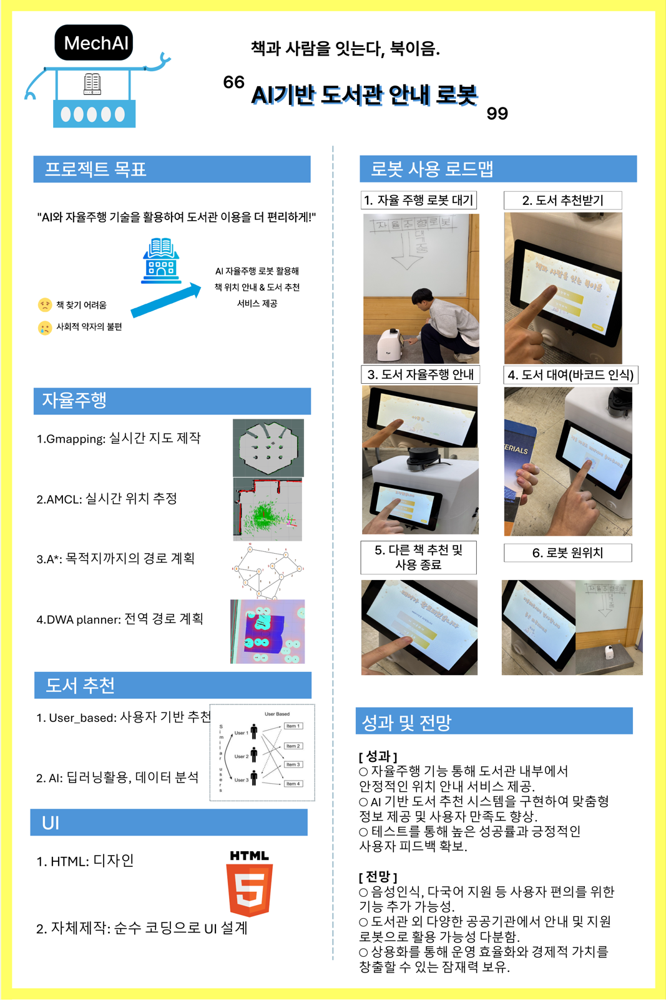

<div align="center">

# 📚 AI기반 도서관 안내 로봇
## AI-Based Library Guide Robot — MechAI "북이음"

**2024 ICT 한이음 공모전 🥉 동상**

> *"책과 사람을 잇는다, 북이음."*

[](https://www.hanium.or.kr)
[]()
[]()
[]()
[]()

</div>

---

## 🎯 프로젝트 목표

> **"AI와 자율주행 기술을 활용하여 도서관 이용을 더 편리하게!"**

| 문제 | 해결 |
|:---:|:---|
| 책 찾기 어려움 | AI 자율주행 로봇이 책 위치까지 직접 안내 |
| 사회적 약자의 불편 | 누구나 쉽게 사용 가능한 맞춤형 도서 서비스 |

---

## 🎬 시연 영상 (Demo)


> 전체 영상: [demo.mp4](https://github.com/jinnwoook/AI-Library-Guide-Robot/blob/main/demo.mp4)

---

## 📋 로봇 사용 로드맵

```
1. 자율주행 로봇 대기
        │
        ▼
2. 도서 추천받기 (UI 터치)
        │
        ▼
3. 도서 자율주행 안내 (목적지까지 이동)
        │
        ▼
4. 도서 대여 (바코드 인식)
        │
        ▼
5. 다른 책 추천 및 사용 종료
        │
        ▼
6. 로봇 원위치 복귀
```

---

## 🛠️ 핵심 기술 구성

### 🤖 자율주행 (Autonomous Navigation)

| 알고리즘 | 역할 |
|:---:|:---|
| **Gmapping** | 실시간 지도 제작 (SLAM 기반 환경 매핑) |
| **AMCL** | 실시간 위치 추정 (Adaptive Monte Carlo Localization) |
| **A\*** | 목적지까지의 최단 경로 계획 (Global Path Planning) |
| **DWA Planner** | 전역 경로 계획 + 실시간 장애물 회피 (Local Planner) |

### 📖 도서 추천 시스템 (Book Recommendation)

| 방식 | 설명 |
|:---:|:---|
| **User-based Collaborative Filtering** | 사용자 기반 협업 필터링으로 유사 이용자 도서 추천 |
| **AI 딥러닝** | 딥러닝 기반 데이터 분석으로 맞춤형 도서 추천 |

### 🖥️ UI (User Interface)

- **HTML5** 기반 디자인
- 순수 코딩으로 자체 제작한 터치 UI

---

## 📊 포스터



---

## ✅ 성과 (Results)

| 항목 | 결과 |
|:---:|:---|
| **자율주행** | 도서관 내부에서 안정적인 위치 안내 서비스 제공 |
| **도서 추천 AI** | 맞춤형 정보 제공 및 사용자 만족도 향상 |
| **테스트** | 높은 성공률과 긍정적인 사용자 피드백 확보 |
| **수상** | 2024 ICT 한이음 공모전 🥉 **동상** |

---

## 🔭 향후 전망

- **음성인식 · 다국어 지원** 등 사용자 편의 기능 추가 가능성
- **도서관 외 다양한 공공기관**에서 안내 및 지원 로봇으로 활용 가능
- **상용화**를 통해 운영 효율화와 경제적 가치를 창출할 수 있는 잠재력 보유

---

## 🛠️ 기술 스택


| 분류 | 기술 |
|:---:|:---|
| **자율주행** | ROS, Gmapping (SLAM), AMCL, A\*, DWA Planner |
| **AI 추천** | User-based Collaborative Filtering, Deep Learning |
| **UI** | HTML5, 순수 JavaScript |
| **하드웨어** | 자율주행 로봇, 바코드 인식 모듈, 터치스크린 |
| **OS** | Linux (ROS 기반) |

---

<div align="center">

*2024 ICT 한이음 공모전 — 🥉 동상 수상작*

</div>
